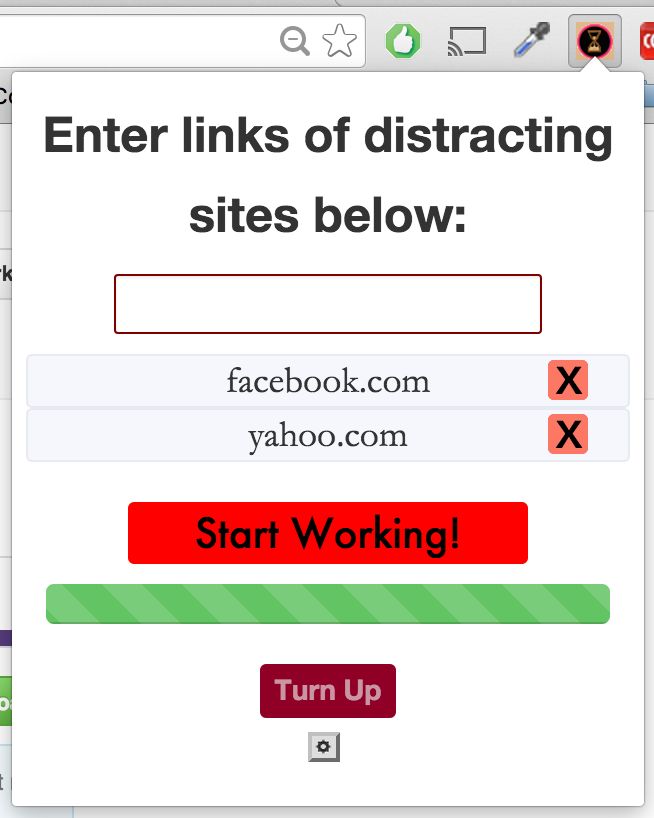

# Timr
A Chrome extension that uses the Pomodoro Technique as a time management tool.

Timr improves focus by hiding websites of your choosing during "work" periods, and then recovers those tabs once "break" begins. It features a slew of settings including timing options, music selection, and several others.

